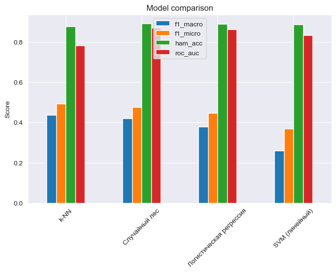

# Многометочная классификация дефектов стали

Проект по многометочной классификации дефектов стальных листов на основе табличных производственных измерений. В работе сравниваются несколько one-vs-rest моделей, проводится настройка гиперпараметров и готовится финальный submission.

## Результаты

| Базовая модель | F1 macro | F1 micro | Hamming accuracy | Macro ROC-AUC |
|---|---:|---:|---:|---:|
| k-NN | **0.4377** | **0.4936** | 0.8780 | 0.7818 |
| Random Forest | 0.4200 | 0.4766 | **0.8915** | **0.8701** |
| Logistic Regression | 0.3799 | 0.4468 | 0.8895 | 0.8631 |
| Linear SVM | 0.2588 | 0.3702 | 0.8880 | 0.8346 |

После подбора гиперпараметров с помощью Optuna модель k-NN достигла macro-F1 **0.4560**, а финальный submission показал **0.78** на public leaderboard.



## Подход

- анализ распределений признаков и дисбаланса классов;
- генерация признаков ориентации, относительного положения и лог-преобразований;
- стандартизация признакового пространства;
- сравнение k-NN, Random Forest, Logistic Regression и Linear SVM в схеме one-vs-rest;
- оценка по Hamming accuracy, F1 micro, F1 macro и macro ROC-AUC;
- настройка k-NN и Random Forest с помощью Optuna;
- обучение финальной модели и подготовка submission-файла.

## Инструменты

Python, pandas, NumPy, scikit-learn, Optuna, matplotlib, seaborn, Jupyter.

## Структура репозитория

```text
comparison_of_classifiers_portfolio.ipynb  основной ноутбук проекта
comparison of classifiers.ipynb            рабочий ноутбук
train.csv / test.csv                        данные соревнования
sample_submission.csv                       шаблон submission
assets/                                     графики, вынесенные из ноутбука
requirements.txt                            зависимости проекта
```
